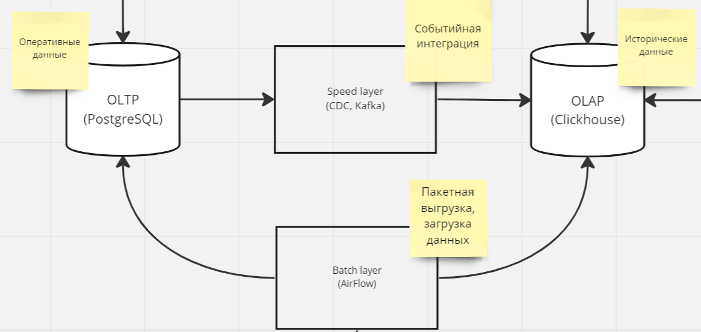

# Имплементация лямбда архитектуры на Debezium, Apache Kafka и Apache Airflow

## Общая архитектура

## Цели

1. Реализовать PoC потоковой обработки
2. Опробовать инструменты: Clickhouse, Kafka Connect, Debezium
3. Изучить возмоэножности Yandex Cloud

## Используемые технологии

* PostgreSQL (Managed)
* Clickhouse (Managed)
* Airflow - batch layer
* Kafka, Zookeeper
* Kafka Connect, Debezium - speed layer
* Nocodb - low code платформа (для демо)
* Superset

## Выводы

Выглядит как over engineering